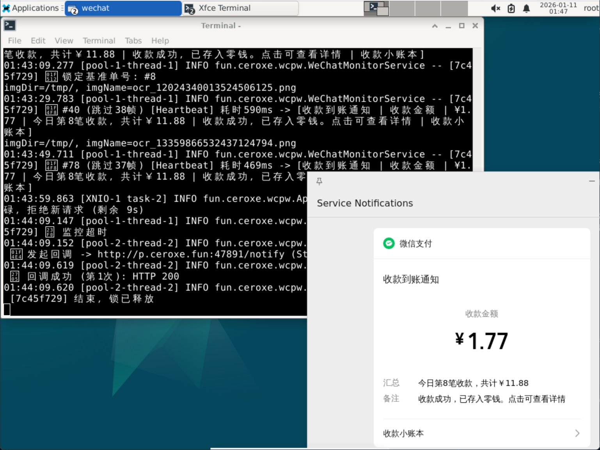

**WCPW** 是一个基于 Java 和 OCR 技术的微信个人免签支付监控中间件。它运行在你的本地电脑或 VNC 服务器上，通过“视觉识别”屏幕上的微信收款弹窗，实现支付回调通知。

核心原理：**HTTP 请求唤醒 -> 锁定任务 -> 屏幕变化检测 -> OCR 识别金额 -> <font color="red">生成安全签名</font> -> 回调业务系统**。

> 🛡️ **安全升级**: 引入了**首包 200ms 安全延迟**与**强制 MD5 字典序签名**机制。配合虚拟线程技术，在彻底防止伪造回调攻击与恶意扫描的同时，保持极高的并发处理能力。

---

## 🛠️ 环境要求

由于本程序依赖屏幕截图 (`java.awt.Robot`)，**无法在无图形界面的 Linux (Headless) 上直接运行**。

### 1. 基础环境
*   **JDK**: **Java 21 或更高版本**（必须，代码使用了虚拟线程与 Record 特性）
*   **OS**: Windows / Linux (带桌面环境 或 VNC) / macOS
*   **依赖库**: Linux 下可能需要安装 `libgomp1` 和 `libgl1-mesa-glx` (OCR 引擎依赖)

### 2. VNC / 屏幕设置 (关键) 🖥️
为了确保 OCR 识别率和性能，请严格遵守以下设置：

*   **分辨率**: 建议 **1024 x 768** (程序针对此分辨率优化了扫描区域)。
*   **微信位置**: 微信 PC 端必须保持开启，且窗口不能最小化。
*   **弹窗设置**: 必须开启微信设置中的 **“收款到账通知”**。
*   **弹窗位置**: 微信通知弹窗必须位于屏幕 **右下角**。
*   **干扰排除**: 尽量保持右下角背景干净，避免有动态壁纸。
*   

---

## 🚀 快速开始

### 1. 启动
下载 Release 中的打包好的 Jar 包并运行：
```bash
java -jar WeChatPayWatcher-X.X.X.jar
```
首次运行会自动生成 `config.properties` 配置文件并退出。

### 2. 配置 (`config.properties`)
修改配置文件，设置你的安全 Token 和**签名密钥**：

```properties
# 服务端口
server.port=9090

# 【必须修改】鉴权 Token，用于调用 WCPW
auth.token=YOUR_API_ACCESS_TOKEN

# 【新增必填】回调签名密钥，必须与你的业务系统 (如 NeoAuthServer) 一致
callback.secret=YOUR_SHARED_SECRET_KEY

# 订单超时时间 (秒)
order.timeout.seconds=300
```

---

## 🔌 API 接口文档

### 1. 发起监控任务
*   **URL**: `http://<IP>:9090/`
*   **Method**: `POST`
*   **安全加固**: 本接口内置 **200ms 强制延迟**。自动化扫描工具会因首包响应过慢而判定端口无效，从而大幅提升隐身安全性。

#### 请求参数 (JSON)
| 字段            | 类型     | 必填 | 说明                                         |
|:--------------|:-------|:---|:-------------------------------------------|
| `token`       | String | 是  | 必须与 `config.properties` 中的 `auth.token` 一致 |
| `money`       | Number | 是  | 期望收到的金额 (例如 1.39)                          |
| `timestamp`   | String | 是  | 业务时间戳                                      |
| `callbackUrl` | String | 是  | **关键**: 必须包含你的订单号参数 (如 `?oid=xxxxx`)       |

---

### 2. 支付结果回调 (核心安全机制)
当检测到收款成功或超时，WCPW 会向你的 `callbackUrl` 发起 POST 请求。

**⚠️ 注意：WCPW 会根据 TreeMap 自动生成的字典序追加签名参数。**

*   **Method**: `POST`
*   **URL 示例**: `.../callback?oid=xxx&money=1.39&status=SUCCESS&timestamp=...&sign=MD5_SIGNATURE`

#### 验签算法 (Security)
为了防止伪造回调，你的业务系统**必须**按以下字典序验证 `sign` 参数：

1.  **参数排序**: 将 `money`, `oid`, `status`, `timestamp` 按 Key 的 ASCII 码从小到大排序。
2.  **拼接格式**: `money=val&oid=val&status=val&timestamp=val&key=YOUR_CALLBACK_SECRET`。
3.  **生成签名**: 对拼接后的字符串进行 **MD5** 运算，并转为**大写**。

**签名原串示例 (严格字典序):**
```text
money=1.39&oid=ORDER_001&status=SUCCESS&timestamp=1768156200000&key=YOUR_SHARED_SECRET_KEY
```

---

## 📂 日志说明

系统会自动在 `logs` 文件夹记录详细的监控轨迹：
*   **[Motion]**: 检测到画面像素变化超过 5%，触发 OCR 扫描。
*   **[Heartbeat]**: 画面静止超过 20 秒，触发强制心跳扫描以校准基准。

**日志示例:**
```text
14:32:10 INFO - [ORDER_001] 📸 #15 [Motion] 耗时 500ms -> [收款到账通知 | ￥1.39]
14:32:30 INFO - [ORDER_001] 📸 #16 [Heartbeat] 耗时 380ms -> [微信支付 | 收款成功]
```

---

## ⚠️ 免责声明
1.  **严禁**用于非法用途。
2.  本项目不保证 100% 的识别准确率，涉及资金交易请务必保留人工复查手段。
3.  使用此软件产生的任何法律后果由使用者自行承担。